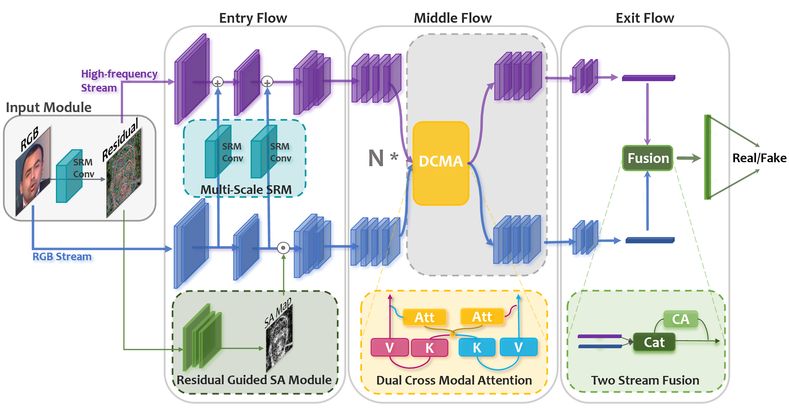

# face-forgery-detection

This is the official code for the core two-stream model from **Generalizing Face Forgery Detection with High-frequency Features (CVPR 2021)**. 

For more details, please refer to the original [[paper](https://arxiv.org/abs/2103.12376)].

## Overview

In this paper, we find that current CNN-based detectors tend to overfit to method-specific color textures and thus fail to generalize. Observing that image noises remove color textures and expose discrepancies between authentic and tampered regions, we propose to utilize the high-frequency noises for face forgery detection.

We carefully devise three functional modules to take full advantage of the high-frequency features. 

- The first is the multi-scale high-frequency feature extraction module that extracts high-frequency noises at multiple scales and composes a novel modality. 
- The second is the residual-guided spatial attention module that guides the low-level RGB feature extractor to concentrate more on forgery traces from a new perspective. 
- The last is the cross-modality attention module that leverages the correlation between the two complementary modalities to promote feature learning for each other. 

The two-stream model is shown as follows.



## Dependency

The model is implemented with PyTorch.

Pretrained Xception weights are downloaded from [this link](http://data.lip6.fr/cadene/pretrainedmodels/xception-b5690688.pth).

## Contact

Please contact - LUO Yuchen - 592mcavoy@sjtu.edu.cn

## Citation

```
@misc{luo2021generalizing,
      title={Generalizing Face Forgery Detection with High-frequency Features}, 
      author={Yuchen Luo and Yong Zhang and Junchi Yan and Wei Liu},
      year={2021},
      eprint={2103.12376},
      archivePrefix={arXiv},
      primaryClass={cs.CV}
}
```

## Notice

Due to some confidential issues, we will not release the training and testing codes. One can find some relevant specifications in the paper.

The training datasets can be downloaded and created following the official instructions of [[FaceForensics++](https://github.com/ondyari/FaceForensics)].


